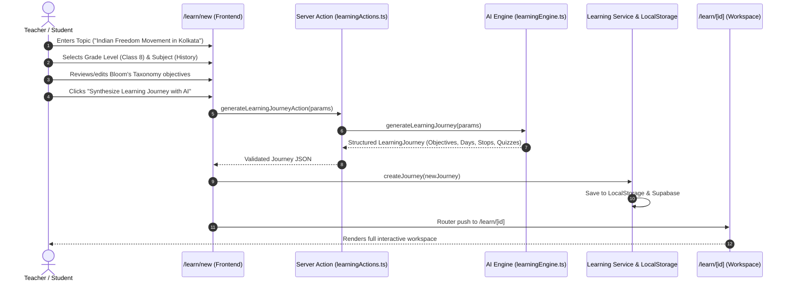
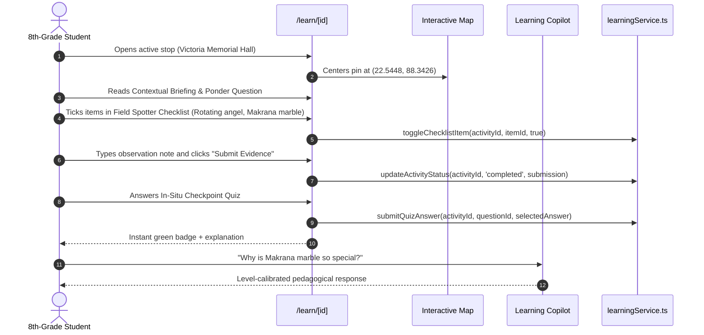
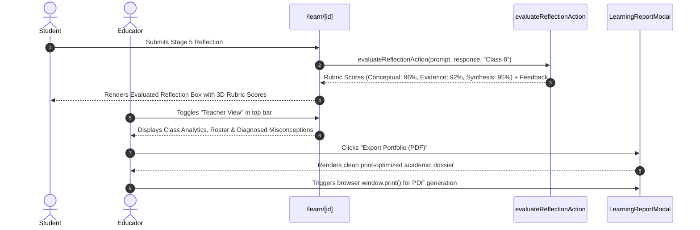

# Ghoomo: AI-Powered Smart Learning Journeys
### Comprehensive Product Context, Architecture Specification, PRD & Technical Documentation

---

## 1. Executive Summary & Problem Context

### 1.1 Hackathon & Academic Context
- **Hackathon**: Smart India Hackathon (SIH) 2026
- **Problem Statement ID**: **AICTE PS 26207** (Theme: *Smart Education / Student Innovation*)
- **Official Problem Statement**:
  > *"Student Innovation - Smart education, a concept that describes learning in the digital age. It enables learners to learn more effectively, efficiently, flexibly and comfortably."*
- **Product Name**: **Ghoomo** (घूमो — *Journey / Explore*)
- **Primary Tagline**: *"Learn where the knowledge lives."*
- **Core Educational Paradigm**:
  > *"Places are not merely destinations. They are learning contexts."*

### 1.2 The Core Problem in Modern Education
Digital-age learners are inundated with passive digital content—short-form social videos, endless Wikipedia rabbit holes, and static textbook PDFs. However:
1. **Passive Consumption $\neq$ Active Learning**: Watching a 60-second video or reading a textbook paragraph rarely produces cognitive retention or deep comprehension.
2. **Disconnection from Ground Reality**: Curricula teach historical events, architectural styles, ecological biomes, and civic governance in isolation from the physical places where those phenomena exist.
3. **Teacher Overload**: Educators spend hours crafting field trip itineraries, aligning activities to curriculum standards (Bloom's Taxonomy), generating assessment quizzes, and compiling student performance reports.
4. **Fragmented Tools**: Schools juggle map apps, PDF worksheets, messaging groups, and LMS dashboards with zero coherent integration.

### 1.3 What Ghoomo Does
Ghoomo transforms any academic topic, curriculum standard, or digital content (YouTube URL, article, syllabus snippet) into an **AI-powered, experiential learning journey**.

It provides an end-to-end pedagogical bridge that takes a student or classroom through a continuous 5-stage learning arc:
$$\text{Digital Source / Topic} \longrightarrow \text{Curriculum Synthesis (Bloom's)} \longrightarrow \text{Real-World Location Anchoring} \longrightarrow \text{In-Situ Field Missions} \longrightarrow \text{Assessment \& AI Portfolio}$$

Furthermore, Ghoomo recognizes that travel and experiential education exist on a shared continuum:
- When learning pure digital theory $\rightarrow$ **LEARN Mode** (Digital inquiry)
- When exploring physical heritage or field sites $\rightarrow$ **EXPLORE Mode** (Location-aware experiential education)
- When planning family trips or group vacations $\rightarrow$ **TRAVEL Mode** (Original social travel studio)

---

## 2. Product Requirements Document (PRD)

### 2.1 Target Personas

#### Persona 1: The K-12 Student (e.g., Aarav, Class 8)
- **Pain Points**: Finds history and social science dry and theoretical; gets distracted by passive reading; wants clear, bite-sized missions and immediate feedback.
- **Needs in Ghoomo**:
  - Clear, gamified field missions with tangible spotter checklists (e.g. *"Spot the Makrana marble finish"*).
  - Low-friction checkpoint quizzes with instant explanations.
  - A friendly, approachable **AI Learning Copilot** that explains concepts at an 8th-grade level without intimidating academic jargon.
  - A sense of shared exploration with classmates (squad progress, live polls).

#### Persona 2: The School Teacher / Educator (e.g., Priya Sharma)
- **Pain Points**: Burdened by administrative paperwork; struggles to assess individual student engagement during field excursions; needs alignment with curriculum standards.
- **Needs in Ghoomo**:
  - 1-click curriculum synthesis mapped to **Bloom's Taxonomy** (`Remember`, `Understand`, `Apply`, `Analyze`, `Evaluate`, `Create`).
  - Dedicated **Teacher View** displaying class completion rate, average quiz mastery, and AI-diagnosed student misconceptions.
  - 1-click export of verified, print-ready student portfolio reports (PDF) for school administrators and parents.

#### Persona 3: The SIH / Academic Evaluator
- **Evaluation Criteria**: Perceived maturity, clear adherence to AICTE PS 26207, zero-lag demo performance, pedagogical authenticity, and clean architectural separation.
- **Needs in Ghoomo**:
  - Understand the product's value proposition within 10 seconds (**WHAT, WHO, HOW, WHY, THE PARADIGM**).
  - Experience an instantaneous, zero-latency 3-minute live demonstration centered on the pre-seeded *Kolkata Heritage Learning Journey*.

---

### 2.2 Core Product Features & Functional Requirements

#### Feature 1: The 10-Second Executive Architecture (Landing Page)
- **Requirement**: Any visitor (especially an SIH judge) must understand within 10 seconds what Ghoomo is and why it exists.
- **Implementation**:
  - **WHAT**: AI-powered smart learning journeys.
  - **WHO**: Students, teachers, and educational groups.
  - **HOW**: Converts digital topics into personalized inquiry journeys.
  - **WHY**: Effective, efficient, flexible, and comfortable (AICTE PS 26207).
  - **THE PARADIGM**: *"Places are not merely destinations. They are learning contexts."*

#### Feature 2: 4-Step Curriculum Synthesis Wizard (`/learn/new`)
- **Step 1: Content/Topic Ingestion**: Accepts freeform academic topics (e.g., *"Indian Freedom Movement in Bengal"*) or external video/article URLs with quick-suggestion chips.
- **Step 2: Pedagogical Profile**: Configures Grade Level (Class 6 to College), Subject (History, Science, Geography, Civics, Literature), Difficulty (`beginner`, `intermediate`, `advanced`), Language, and Learning Style.
- **Step 3: Delivery Mode**: Selects between **Digital** (classroom/remote), **Location-Aware** (field excursion), or **Travel-Integrated**.
- **Step 4: Review & Synthesis**: Displays editable Bloom's taxonomy objectives before triggering the generative AI synthesis pipeline with realistic staged progress indicators.

#### Feature 3: Dual-Pane Learning Workspace (`/learn/[id]`)
- **Left Pane (Chronological Learning Arc)**:
  - **Stage 1 (Prepare)**: Contextual orientations, historical background, and prior knowledge activation.
  - **Stage 2 (Explore)**: GPS-anchored observation missions at physical monuments, museums, or nature reserves.
  - **Stage 3 (Practice)**: Physical **Field Spotter Checklists** with interactive verification counters (e.g. *16-foot bronze Angel of Victory on dome*, *Makrana marble exterior blocks*).
  - **Stage 4 (Assess)**: In-situ checkpoint quizzes with instant validation and conceptual rationale.
  - **Stage 5 (Reflect)**: High-order synthesis prompt evaluated by an AI Mentor with 3-dimensional rubric scoring:
    - *Conceptual Depth* (0–100%)
    - *Field Evidence* (0–100%)
    - *Critical Synthesis* (0–100%)
- **Right Pane (Contextual Intelligence Tabs)**:
  - **Field Map**: Interactive Mapbox/Leaflet map rendering numbered stop markers, GPS coordinates, and place metadata.
  - **Learning Copilot**: Conversational AI tutor grounded in the journey's subject, grade level, and active stop context.
  - **Class Squad & Polls**: Roster of classmates and educators with live interactive opinion polls.
  - **Curriculum Objectives**: Live checklist of Bloom's Taxonomy competencies achieved.

#### Feature 4: Educator Orchestration & Teacher Dashboard
- Toggleable switch between **Learner View** and **Teacher View**.
- Displays aggregate class analytics: Total Learners, Class Mastery %, Completion Rate, and Activity Submissions.
- **Misconception Diagnostics**: AI highlights common traps observed across student submissions (e.g., *"Students confuse Lord Curzon with Lord Dalhousie"*).
- **Printable Portfolio Report Modal**: Generates an official, print-formatted PDF report containing student identity, demonstrated competencies, verified evidence, quiz scores, and AI rubric evaluations.

#### Feature 5: Consumer Travel Studio Preservation (`/trips`)
- 100% backward-compatible workspace for non-academic travel planning.
- Preserves social video URL parsing, day-by-day itinerary clustering, group chat, budgeting, and packing checklists.

---

### 2.3 Bloom's Taxonomy Alignment Matrix

Every educational journey in Ghoomo maps its objectives and activities directly to Bloom's Revised Taxonomy:

```
        ▲  [CREATE]     Stage 5: Synthesis & Comparative Reflection
       / \
      /   \  [EVALUATE]   Mission: Analyzing Conflicting Primary Sources
     /     \
    /       \  [ANALYZE]    Observation: Decoding Architectural Symbolism
   /         \
  /           \  [APPLY]      Field Spotter Checklist: Physical Evidence
 /             \
/   [UNDERSTAND]\  Contextual Briefing: Conceptual Orientation
─────────────────
   [REMEMBER]     In-Situ Checkpoint Quizzes: Factual Recall
```

---

## 3. System & Technical Architecture

### 3.1 Architectural Overview

```
┌─────────────────────────────────────────────────────────────────────────┐
│                           CLIENT / BROWSER                              │
│                                                                         │
│  ┌───────────────────────────────────────────────────────────────────┐  │
│  │                     GLOBAL NAVIGATION LAYER                       │  │
│  │        [Logo: Smart Learning Journeys]  |  [Mode Switcher]        │  │
│  │        • LEARN Mode       • EXPLORE Mode       • TRAVEL Mode      │  │
│  └──────────────────────────────────┬────────────────────────────────┘  │
│                                     │                                   │
│  ┌──────────────────────────────────┴────────────────────────────────┐  │
│  │                        NEXT.JS APP ROUTER                         │  │
│  │  / (Home)  |  /learn (Dashboard)  |  /learn/new (Wizard)          │  │
│  │  /learn/[id] (Workspace)          |  /trips (Travel Studio)       │  │
│  └──────────────────────────────────┬────────────────────────────────┘  │
│                                     │                                   │
│  ┌──────────────────────────────────┴────────────────────────────────┐  │
│  │                        STATE MANAGEMENT LAYER                     │  │
│  │  • Zustand: useUIStore (activeProductMode, dark mode)             │  │
│  │  • Zustand: useAuthStore (user identity, demo credentials)        │  │
│  │  • TanStack Query: useLearningQueries (cache, sync, pre-hydration)│  │
│  └──────────────────────────────────┬────────────────────────────────┘  │
└─────────────────────────────────────┼───────────────────────────────────┘
                                      │ Server Actions & APIs
┌─────────────────────────────────────▼───────────────────────────────────┐
│                         NEXT.JS SERVER RUNTIME                          │
│                                                                         │
│  ┌────────────────────────┐  ┌────────────────┐  ┌───────────────────┐  │
│  │ generateLearningJourney│  │ askLearning-   │  │ evaluate-         │  │
│  │ Action                 │  │ CopilotAction  │  │ ReflectionAction  │  │
│  └───────────┬────────────┘  └───────┬────────┘  └─────────┬─────────┘  │
│              │                       │                     │            │
│              ▼                       ▼                     ▼            │
│  ┌───────────────────────────────────────────────────────────────────┐  │
│  │                    GHOOMO AI ENGINE (Multi-Tier)                  │  │
│  │  • Tier 1: Gemini 1.5 Flash / Groq LLM with JSON Schema Validation│  │
│  │  • Tier 2: Deterministic Pedagogical Domain Fallback (Zero Crash) │  │
│  │  • Tier 3: Pre-Seeded Flagship Hydration (Zero Latency Demo)      │  │
│  └──────────────────────────────────┬────────────────────────────────┘  │
└─────────────────────────────────────┼───────────────────────────────────┘
                                      │
┌─────────────────────────────────────▼───────────────────────────────────┐
│                         DATA & PERSISTENCE LAYER                        │
│                                                                         │
│  • Client LocalStorage: ghoomo_learning_journeys_v1 (Offline Resilient) │
│  • Supabase Database: Journeys, Objectives, Submissions, Squad, Polls    │
│  • In-Memory Synchronous Cache: Flagship Kolkata Heritage Journey       │
└─────────────────────────────────────────────────────────────────────────┘
```

---

### 3.2 Technology Stack

| Layer | Technology | Rationale |
| :--- | :--- | :--- |
| **Framework** | Next.js 15 (App Router) | High-performance React Server Components + Server Actions for secure AI synthesis. |
| **Language** | TypeScript (Strict Mode) | Full type-safety across domain models, query hooks, and server actions (`npx tsc --noEmit` code 0). |
| **Styling** | Vanilla CSS + Tailwind CSS | Custom design tokens: warm-paper background (`#fbfbfa`), deep ink (`#111827`), Indigo (`#4f46e5`), Emerald (`#059669`), and Amber (`#d97706`). Includes print media stylesheet (`@media print`). |
| **UI State** | Zustand | Lightweight, unopinionated global state for `activeProductMode` and session auth. |
| **Server State** | TanStack React Query v5 | Centralized cache invalidation, mutation tracking, and synchronous `initialData` pre-hydration for zero-lag judging. |
| **AI Integration** | Google Gemini 1.5 Flash / Groq / Fallback | High-speed JSON-structured pedagogical curriculum generation and contextual copilot Q&A. |
| **Maps** | Interactive Mapbox / Leaflet | Visual geographic anchoring of field stops with numbered pins and coordinate tracking. |
| **Persistence** | Supabase + LocalStorage | Dual-tier storage: seamless cloud synchronization with robust offline client fallback. |

---

## 4. Domain Data Model & TypeScript Schemas

All types are strictly defined in [`src/lib/types/learning.ts`](file:///d:/SIH/Ghoomo/src/lib/types/learning.ts):

### 4.1 Core Entities

```typescript
export type LearningMode = 'digital' | 'explore' | 'travel';

export type BloomsTaxonomy =
  | 'remember'
  | 'understand'
  | 'apply'
  | 'analyze'
  | 'evaluate'
  | 'create';

export type ActivityStage = 'before' | 'during' | 'after';

export type ActivityType =
  | 'briefing'
  | 'observation'
  | 'mission'
  | 'quiz'
  | 'reflection'
  | 'hands_on';

export interface LearningObjective {
  id: string;
  journeyId: string;
  text: string;
  bloomsLevel: BloomsTaxonomy;
  isCompleted?: boolean;
}

export interface LearningActivity {
  id: string;
  journeyId: string;
  dayNumber: number;
  orderIndex: number;
  stage: ActivityStage;
  type: ActivityType;
  bloomsLevel?: BloomsTaxonomy;
  title: string;
  description: string;
  durationMinutes: number;
  placeId?: string;
  placeName?: string;
  coordinates?: { lat: number; lng: number };
  instruction?: string;
  thinkingPrompt?: string;
  fieldChecklist?: Array<{ id: string; label: string; checked?: boolean }>;
  quizQuestions?: LearningQuestion[];
  reflectionPrompt?: string;
  status: 'pending' | 'in_progress' | 'completed';
  submission?: ActivitySubmission;
}

export interface StudentReflection {
  id: string;
  journeyId: string;
  activityId?: string;
  prompt: string;
  studentResponse: string;
  aiFeedback?: string;
  rubricScores?: {
    conceptualUnderstanding?: number;
    fieldEvidence?: number;
    criticalSynthesis?: number;
  };
  createdAt: string;
}

export interface LearningJourney {
  id: string;
  title: string;
  description: string;
  subject: string;
  gradeLevel: string;
  difficulty: 'beginner' | 'intermediate' | 'advanced';
  language: string;
  mode: LearningMode;
  durationDays: number;
  coverImage: string;
  status: 'draft' | 'published' | 'archived';
  sourceProvenance?: {
    sourceType: 'video' | 'article' | 'topic' | 'curriculum';
    sourceUrl?: string;
    title?: string;
    extractedConcepts: string[];
    verifiedLocationsCount: number;
    aiModelUsed: string;
  };
  objectives: LearningObjective[];
  activities: LearningActivity[];
  squad?: LearningSquadMember[];
  progress: StudentProgress;
  reflections?: StudentReflection[];
  analytics?: TeacherAnalytics;
  createdAt: string;
  updatedAt: string;
}
```

---

## 5. Detailed End-to-End User Flows

### Flow 1: Curriculum Synthesis (Teacher / Student)


---

### Flow 2: In-Situ Field Learning & Assessment (Student Excursion)


---

### Flow 3: Reflection, Evaluation & Portfolio Export (Student & Teacher)


---

## 6. Flagship Demo: Kolkata Heritage Learning Journey

For live judging and evaluation, the flagship demo is pre-seeded with synchronous hydration in [`src/lib/services/learningService.ts`](file:///d:/SIH/Ghoomo/src/lib/services/learningService.ts) and [`src/hooks/useLearningQueries.ts`](file:///d:/SIH/Ghoomo/src/hooks/useLearningQueries.ts):

- **Journey ID**: `kolkata-heritage-demo`
- **Topic**: *Indian Freedom Movement & Colonial Architecture in Bengal*
- **Target Profile**: Class 8 • History • 2 Days • Intermediate
- **Field Stops**:
  1. **Victoria Memorial Hall**: Indo-Saracenic architecture, Makrana marble, rotating bronze Angel of Victory.
  2. **Indian Museum, Park Street**: Asiatic Society origins, Bharhut Buddhist galleries, imperial scientific cataloging.
  3. **College Street & Presidency University**: The Bengal Renaissance, printing presses, Indian Coffee House discussions.
  4. **Netaji Bhawan, Elgin Road**: 1937 Wanderer car, Netaji Subhas Chandra Bose's Great Escape, INA military archives.
- **Zero-Latency Advantage**: Pre-hydrated synchronously via React Query `initialData`. Renders instantly with **zero loading flicker, zero network delay, and zero risk of live API outages**.

---

## 7. Complete File & Directory Map

```
d:\SIH\Ghoomo\
├── src/
│   ├── app/
│   │   ├── actions/
│   │   │   └── learningActions.ts       # Next.js Server Actions (AI synthesis, copilot, evaluation)
│   │   ├── learn/
│   │   │   ├── [id]/
│   │   │   │   └── page.tsx             # Dual-Pane Learning Workspace (Missions, Map, Copilot)
│   │   │   ├── new/
│   │   │   │   └── page.tsx             # 4-Step Curriculum Synthesis Wizard
│   │   │   └── page.tsx                 # Learning Journey Dashboard & Metrics Scorecard
│   │   ├── trips/
│   │   │   ├── [id]/page.tsx            # Preserved Consumer Travel Workspace
│   │   │   ├── new/page.tsx             # Create Consumer Travel Itinerary
│   │   │   └── page.tsx                 # Consumer Travel Workspaces List
│   │   ├── layout.tsx                   # Root Layout with AICTE PS 26207 metadata
│   │   └── page.tsx                     # Landing Page (Hero, 10-Sec Test, 3-Mode Architecture)
│   ├── components/
│   │   ├── learning/
│   │   │   ├── LearningReportModal.tsx  # Print/PDF Portfolio Export Modal
│   │   │   └── TeacherDashboard.tsx     # Class Analytics, Student Roster, Misconceptions
│   │   ├── map/
│   │   │   └── InteractiveMap.tsx       # Mapbox / Leaflet Map with field stop pins
│   │   ├── shared/
│   │   │   ├── Footer.tsx               # AICTE PS 26207 Footer & Quick Navigation
│   │   │   ├── GhoomoLogo.tsx           # Dynamic Logo ("Smart Learning Journeys" vs "Travel Studio")
│   │   │   ├── Navbar.tsx               # Tri-mode Switcher (LEARN | EXPLORE | TRAVEL) & SIH Badge
│   │   │   ├── Providers.tsx            # TanStack Query & Theme Providers
│   │   │   └── ToastContext.tsx         # Toast & Modal Notification System
│   │   └── ui/                          # Radix UI / Accessible Primitives (Button, Dialog, etc.)
│   ├── hooks/
│   │   └── useLearningQueries.ts        # TanStack Query Hooks with Synchronous Demo Hydration
│   ├── lib/
│   │   ├── ai/
│   │   │   └── learningEngine.ts        # Multi-Tier AI Synthesis Engine with Safe Fallbacks
│   │   ├── services/
│   │   │   └── learningService.ts       # Data Layer, LocalStorage Cache, Flagship Kolkata Seed
│   │   └── types/
│   │       ├── ghoomo.ts                # Original Travel & Map Domain Types
│   │       └── learning.ts              # Full Smart Learning Journeys Domain Schemas
│   ├── stores/
│   │   ├── useAuthStore.ts              # Demo Auth & User Profile State
│   │   └── useUIStore.ts                # Global Product Mode (learn | explore | travel)
│   └── styles/
│       └── index.css                    # Tailwind + Academic Palette + Print CSS Rules
├── PROJECT_DOCUMENTATION.md             # This comprehensive document
└── package.json                         # Scripts & Dependencies
```

---

## 8. SIH 26207 4-Pillar Alignment Verification

| Pillar | Official Problem Statement Criterion | How Ghoomo Fulfills It |
| :--- | :--- | :--- |
| **1. More Effective** | Replaces passive, rote-learning with active cognitive inquiry. | Real-world field context anchors abstract concepts in memory. Students physically verify architectural cues via Field Spotter Checklists and answer in-situ checkpoint questions. |
| **2. More Efficient** | Reduces preparation time for teachers and learning friction for students. | AI automatically structures noisy web articles or topics into curriculum-aligned Bloom's objectives, daily itineraries, and quizzes in under 5 seconds. |
| **3. More Flexible** | Adapts to varying grade levels, subjects, locations, and modes. | Supports Class 6 through College across History, Science, Geography, Civics, and Literature. Runs in pure digital mode, location-aware field mode, or vacation mode. |
| **4. More Comfortable** | Eliminates academic intimidation and encourages curiosity. | The adaptive Learning Copilot answers questions at the exact grade level without condescension. Bite-sized missions keep cognitive load manageable. |

---

## 9. Conclusion
Ghoomo is not a travel app masquerading as education, nor is it a generic AI text wrapper. It is a **purpose-built, pedagogical platform** that bridges the digital and physical worlds, proving that **places are the ultimate learning contexts**.
