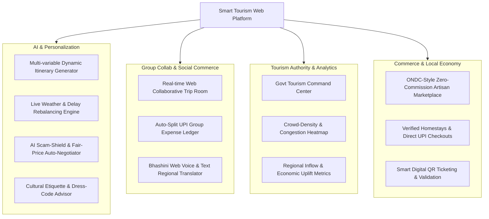
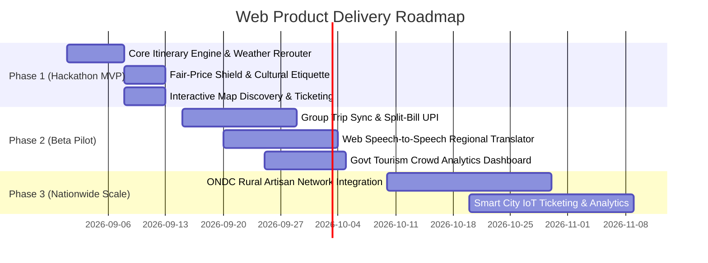

# Product Requirements Document (PRD)
## Project: Smart Tourism & Hospitality Web Platform (SIH26207)
### "Discover India, Every Step of the Way" (100% Web Platform)

---

## 1. Executive Summary & Problem Overview
The tertiary tourism & hospitality sector across India faces massive fragmentation. Travelers navigate disconnected channels for discovery, itinerary scheduling, multilingual assistance, local homestay bookings, and fair-pricing transparency. This fragmentation directly degrades visitor experiences, limits direct revenue for local micro-vendors/homestays, and causes planning friction for domestic and international tourists.

**Smart Travel & Tourism (SIH26207)** provides a unified, hyper-personalized, AI-powered **responsive web portal & platform** that streamlines the entire travel lifecycle directly in the web browser: Discovery -> Planning -> Live Dynamic Schedule Adaptation -> Fair Price & Cultural Advisory -> ONDC-Style Local Commerce -> Feedback & Analytics.

---

## 2. Target Audience & Stakeholders

| Stakeholder | Key Web Portal Needs & Objectives |
| :--- | :--- |
| **Domestic & Foreign Tourists** | Frictionless hyper-personalized trip generation, multi-lingual audio/text support, interactive map discovery, scam protection, cultural etiquette advisories, single-click bookings. |
| **Local Businesses & Homestays** | Direct web marketplace reach, verified listing management, zero middleman commission leakage, multilingual translation with guests. |
| **Travel Agencies & Tour Guides** | Pre-packaged dynamic tours, itinerary distribution, verified booking workflows. |
| **Govt. Tourism Boards & Authorities** | Tourism heatmaps, crowd management analytics, regional tourism trends, grievance redressal tracking. |

---

## 3. Product Goals & Success Metrics (KPIs)

- **Planning Efficiency:** Reduce trip itinerary creation time from >3 hours to <60 seconds on the web portal.
- **Conversion & Retention:** >40% of generated itineraries converted into booked attractions/homestays.
- **Scam & Friction Reduction:** >85% satisfaction on fair-pricing estimations and cultural etiquette advisories.
- **Engagement:** Average web session duration > 8 minutes; >70% adoption of the multilingual AI concierge.
- **System Reliability:** 99.9% uptime with sub-second API latency for recommendations and instant web performance.

---

## 4. User Personas & User Journeys

### Persona A: Elena (International Solo Traveler)
- **Pain Points:** Language barriers, fear of scams, overcharging, rigid travel packages.
- **Journey:** Lands on the web platform -> Uses Fair-Price Lens for local transit -> Gets instant dynamic itinerary with multilingual audio guide -> Accesses verified homestays & cultural etiquette guide.

### Persona B: Ramesh & Family / Friends (Domestic Group Travelers)
- **Pain Points:** Crowded spots, rigid packages, lack of verified local homestays, disorganized group expense splitting.
- **Journey:** Creates a shared Group Room on the website -> Friends vote on spots -> Dynamic itinerary balances budget and interests -> Auto-split UPI ledger settles costs -> Receives live weather/crowd alerts.

---

## 5. Functional Requirements (Epics & Feature Specifications)

### Epic 1: Hyper-Personalized AI Itinerary Planner & Dynamic Rerouter
- **FR-1.1:** Preference matrix ingestion (Budget, Duration, Interests: Heritage, Eco-tourism, Spiritual, Food, Adventure, Accessibility).
- **FR-1.2:** Dynamic weather & delay-aware re-balancing (e.g., swapping outdoor tours with indoor palaces upon rain detection).

### Epic 2: AI Scam-Shield, Fair-Price Lens & Cultural Etiquette Guard
- **FR-2.1:** Fair-Price Estimator for local auto-rickshaws, taxis, and handicrafts with multi-dialect negotiation phrases.
- **FR-2.2:** Cultural sensitivity alerts: dress codes, photography permissions, footwear rules, and optimal prayer timings for religious shrines.

### Epic 3: Collaborative Group Trip Planning & Split-Bill Ledger
- **FR-3.1:** Real-time multi-user web planning room with attraction upvoting/downvoting.
- **FR-3.2:** Shared expense ledger with one-click UPI settlement links.

### Epic 4: Multilingual Voice & Text Regional Translator (Bhashini-Style)
- **FR-4.1:** Bi-directional speech-to-speech and text translation between foreign/domestic languages and regional Indian dialects (Hindi, Tamil, Telugu, Bengali, Marathi, etc.) using Web Speech APIs.

### Epic 5: ONDC Zero-Commission Local Micro-Economy
- **FR-5.1:** Verified onboarding for local artisans, tribal homestays, and certified regional tour guides.
- **FR-5.2:** "Adopt a Heritage Village" algorithm reserving 15–20% of tourist recommendations for authentic local craftsmen.

### Epic 6: Govt Tourism Authority Command & Crowd Analytics Dashboard
- **FR-6.1:** Real-time anonymous crowd density heatmaps to analyze footfall and prevent congestion at major monuments/temples.
- **FR-6.2:** Regional tourism analytics, economic inflow stats, and grievance telemetry.

---

## 6. Non-Functional Requirements (NFRs)
- **Performance:** First Contentful Paint (FCP) < 1.2s; AI itinerary generation latency < 2.5s.
- **Security & Privacy:** End-to-end TLS 1.3 encryption, GDPR and DPDP Act 2023 (India) compliance.
- **Availability & Scalability:** Auto-scaling serverless web architecture on Vercel capable of handling 50k concurrent users.

---

## 7. Release Roadmap (3-Phase Rollout)

