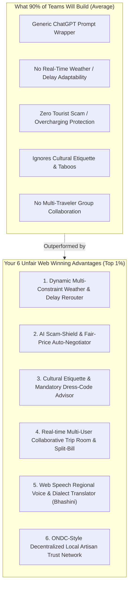
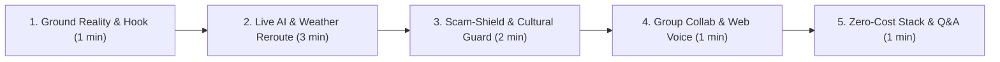

# 🏆 SIH 2026 Competitive Winning Strategy & Unique Web Differentiators (USPs)
## Problem Statement: SIH26207 (Smart Travel & Tourism Web Platform)

---

## 1. The Reality of the SIH 2026 Competitive Landscape
In SIH, **80% of teams building tourism web projects will build the exact same thing**:
- A basic Next.js / React UI with a generic map.
- A static ChatGPT prompt that outputs generic day-1 / day-2 bullet points.
- A dummy booking form and a static contact page.

**Judges see dozens of these generic clones and discard them.** To win the **Top 1% Winner's Trophy**, your web platform must solve real ground realities in Indian tourism with deep, interactive web features.

---

## 2. The 6 Killer Web USPs That Will Guarantee You Stand Out

---

### 🌟 USP 1: "Dynamic Reality-Aware" Multi-Agent Itinerary Optimizer (Not a Simple ChatGPT Wrapper)
- **The Common Flaw:** Other teams send `Give me a 3-day trip to Jaipur` to ChatGPT, getting static text that breaks when it rains or monuments close.
- **Your Winning Edge:** Build a **Multi-Constraint Agent System**:
  - **Live Weather Adaptation:** If rain/monsoon is detected at 3 PM in Kerala or Udaipur, the AI dynamically swaps outdoor boating with an indoor palace/museum *live on the website timeline*.
  - **Dynamic Mid-Trip Delay Rebalancing:** A single tap *"I'm running 45 min late"* recalculates the rest of the day's route topology dynamically without breaking restaurant/hotel bookings.

---

### 🌟 USP 2: Tourist Scam-Shield & Fair-Price Auto-Negotiator
- **The Ground Reality:** Tourist scams (overpriced auto-rickshaws, inflated handicraft rates) are the #1 complaint of tourists across Delhi, Agra, Jaipur, Varanasi, and Goa.
- **Your Winning Edge:**
  - **Fair-Price Lens:** Tourist enters starting point and destination. The system estimates the official government transport rate based on distance and vehicle type.
  - **Audio Negotiation Assistant:** The web app generates polite negotiation phrases with real browser audio playback in local dialects (Hindi, Rajasthani, Tamil).

---

### 🌟 USP 3: Cultural Sensitivity & Etiquette Advisor (Taboo & Dress-Code Guard)
- **The Ground Reality:** Tourists often get turned away or fined at temples and heritage sites for violating dress codes, photography restrictions, or visiting during forbidden prayer rituals.
- **Your Winning Edge:**
  - Context-aware **Etiquette Alerts**: When a user adds a heritage or spiritual site to their itinerary (e.g., Golden Temple, Meenakshi Temple, Jama Masjid), the web app automatically flags:
    - Mandatory attire requirements (head covering, shoulder/knee modesty).
    - Footwear rules and cloakroom availability.
    - Photography permits and forbidden zones.
    - Optimal non-rush darshan hours.

---

### 🌟 USP 4: Real-Time Collaborative Group Planning & Auto-Split UPI Ledger ("Figma for Travel")
- **The Ground Reality:** Group travel planning is chaotic over WhatsApp, and tracking shared expenses creates confusion.
- **Your Winning Edge:**
  - **Live Collaborative Web Room:** Friends join via a simple web link / QR code and vote on attractions in real time.
  - **Auto-Split UPI Ledger:** Automatically tracks group expenses and calculates fair settlements with instant 1-click UPI payment deep-links.

---

### 🌟 USP 5: Bhashini-Style Web Speech Regional Voice Translator
- **The Ground Reality:** Language barriers between domestic/foreign tourists and local street artisans or homestay hosts.
- **Your Winning Edge:**
  - Built-in **Web Speech API** two-way speech-to-speech and text translation supporting 10+ regional Indian languages (Hindi, Tamil, Telugu, Bengali, Marathi, Gujarati, Kannada, etc.) directly in the browser with zero external app downloads.

---

### 🌟 USP 6: ONDC & Vocal-for-Local Micro-Economy Marketplace
- **The Ground Reality:** Aggregators charge 15–30% commissions, excluding rural craftsmen, tribal homestay owners, and certified regional guides.
- **Your Winning Edge:**
  - **Zero-Commission Verified Vendor Network:** Direct UPI QR integration with verified badges.
  - **"Adopt a Heritage Village" Algorithm:** Deliberately routes 20% of tourist recommendations to verified offbeat local craftsmen, directly boosting rural tourism revenue and supporting the Government's *Dekho Apna Desh* initiative.

---

## 3. High-Impact 8-Minute Web Demo & Judge Pitch

| Time | Phase | What to Show & Say on the Web Portal |
| :--- | :--- | :--- |
| **0:00 - 1:00** | **The Hook** | *"Judges, when tourists visit India, their trip breaks not because of flights, but because of 3 things: overcharging scams, cultural taboos, and rigid itineraries that break the moment it rains."* |
| **1:00 - 3:00** | **Live Itinerary & Weather Reroute** | Generate a dynamic 3-day itinerary on the web. Trigger: *"Simulate sudden 2 PM monsoon alert"*. Watch the AI dynamically swap outdoor boat rides with an indoor museum live on screen in under 2 seconds. |
| **3:00 - 4:30** | **Fair-Price Shield & Cultural Guard** | Show the **Fair-Price Lens**: Calculate estimated auto-rickshaw fair pricing and play the local dialect negotiation audio. Show the dress code/etiquette advisory for temples. |
| **4:30 - 6:00** | **Group Sync & Web Voice Translation** | Open a second browser tab to demonstrate real-time collaborative group voting. Speak English into the Web Speech translator to hear it read out aloud in Tamil/Hindi. |
| **6:00 - 8:00** | **Tech Stack & Business Impact** | Highlight the 100% free Vercel + Supabase architecture, PostGIS sub-10ms queries, and ONDC zero-commission economic uplift. |
