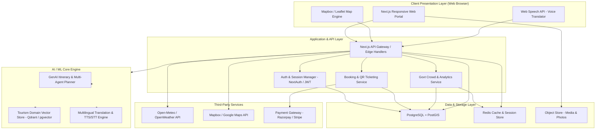
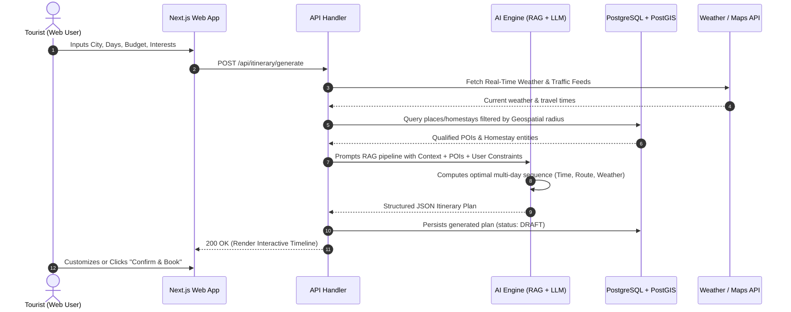
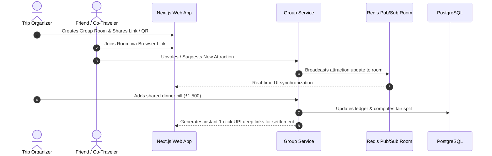
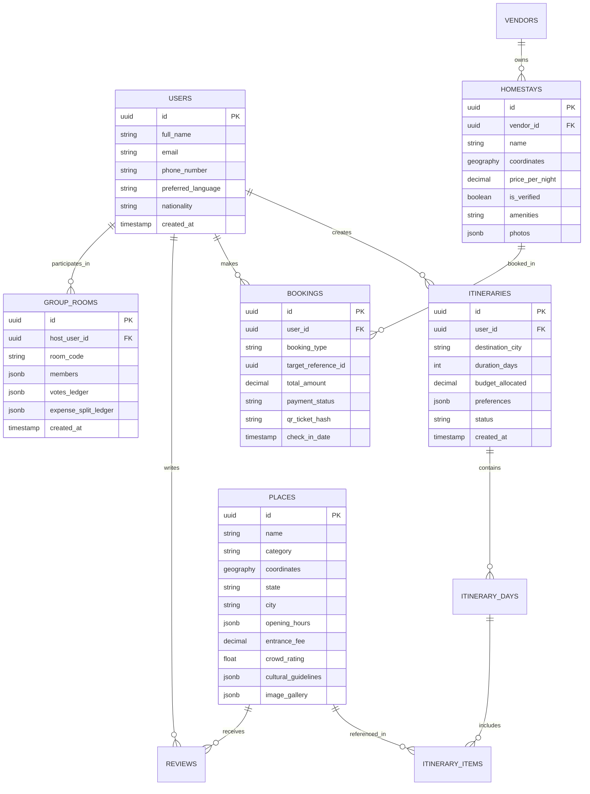

# Software Requirements Specification (SRS)
## Project: Smart Tourism & Hospitality Web Platform (SIH26207)
### Specification Standard: IEEE 830 / ISO/IEC/IEEE 29148 Compliant

---

## 1. Introduction

### 1.1 Purpose
This Software Requirements Specification (SRS) defines the complete software architecture, technical interfaces, data models, functional requirements, and behavioral constraints for the **Smart Travel & Tourism Web Platform (SIH26207)**.

### 1.2 Scope
The system is an end-to-end intelligent tourism web platform consisting of:
1. **Client Layer:** Responsive Next.js 14+ Web Application with interactive Mapbox/Leaflet Maps, glassmorphic UI, and Web Speech API.
2. **Application & API Layer:** REST/Serverless API micro-routes orchestrating business logic, AI recommendations, and third-party integrations.
3. **AI/ML Engine:** Large Language Model (LLM) + Knowledge Graph driven recommendation and dynamic weather-delay routing service.
4. **Data Layer:** PostgreSQL (relational structured data) with PostGIS (geospatial operations) and Upstash Redis (caching and session management).
5. **External Adapters:** Weather API, Geospatial Mapbox/Google Maps, Payment Gateway (Razorpay/Stripe).

### 1.3 Definitions, Acronyms, and Abbreviations
- **PRD:** Product Requirements Document
- **PostGIS:** Spatial database extender for PostgreSQL
- **RAG:** Retrieval-Augmented Generation
- **DPDP Act:** Digital Personal Data Protection Act, 2023 (India)

---

## 2. Overall Description

### 2.1 System Architecture & Data Flow

---

## 3. Specific Technical Requirements

### 3.1 External Interface Requirements

#### 3.1.1 User Interfaces (UI/UX)
- Modern, clean design using glassmorphism, responsive grid layouts, and high-contrast accessibility compliance (WCAG 2.1 AA).
- Multi-theme support (Dark/Light mode) tailored for bright sunlight outdoors and battery conservation.
- Touch-optimized web navigation for desktop, tablet, and mobile browsers.

#### 3.1.2 Hardware & Web API Interfaces
- **Web Geolocation API:** On-demand GPS location capture for nearby attraction distance calculations and fair auto fares.
- **Web Speech API:** Built-in browser speech recognition and synthesis for voice translation dialogues.

#### 3.1.3 Software & API Interfaces
- **Geospatial & Navigation:** Mapbox GL JS / OpenStreetMap for route rendering and matrix calculations.
- **Weather Services:** Open-Meteo / OpenWeather API for meteorological forecasts and alerts.
- **Payment Gateway:** Razorpay / Stripe SDK supporting UPI AutoPay, cards, and multi-currency conversions.

---

## 4. Detailed System Features & Use Cases

### 4.1 Use Case UC-01: Generate Dynamic AI Itinerary with Weather Adaptation

### 4.2 Use Case UC-02: Collaborative Group Trip Planning & Split-Bill

---

## 5. Database Schema & Data Models

---

## 6. Security, Reliability & Compliance Requirements

### 6.1 Data Privacy & Encryption
- **Data in Transit:** Enforced HTTPS with TLS 1.3 and HSTS.
- **Data at Rest:** AES-256 encryption on all relational tables containing user data.
- **DPDP Act & GDPR:** Explicit user consent flags and full data erasure capabilities.

### 6.2 Availability & Disaster Recovery
- Multi-AZ cloud deployment with automatic failover.
- Redis replication for persistent session storage and caching.
- Daily automated database snapshots with RPO <= 1 hour and RTO <= 15 minutes.

---

## 7. Verification & Acceptance Criteria (Testing Matrix)

| Test ID | Test Scenario | Acceptance Criteria |
| :--- | :--- | :--- |
| **TC-01** | Itinerary Generation with varying parameters | Complete JSON itinerary returned in < 3.0 seconds with zero overlapping schedule conflicts. |
| **TC-02** | Multilingual Web Voice Conversion | Audio prompt in Tamil/Hindi accurately transcribed and responded to in < 1.5 seconds. |
| **TC-03** | Interactive Map & POI Rendering | Map vector tiles and POI markers render smoothly at >= 60 FPS. |
| **TC-04** | Real-time Group Collaboration | Vote or bill update reflects in connected browsers in < 200 ms. |
| **TC-05** | Fair-Price Calculator | Correct auto-rickshaw fare estimate generated based on distance with regional negotiation phrases. |
