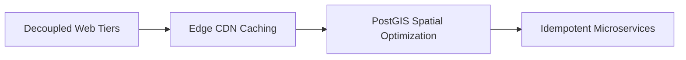
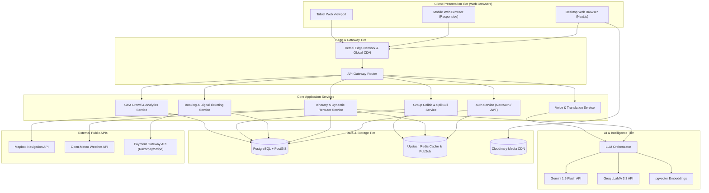
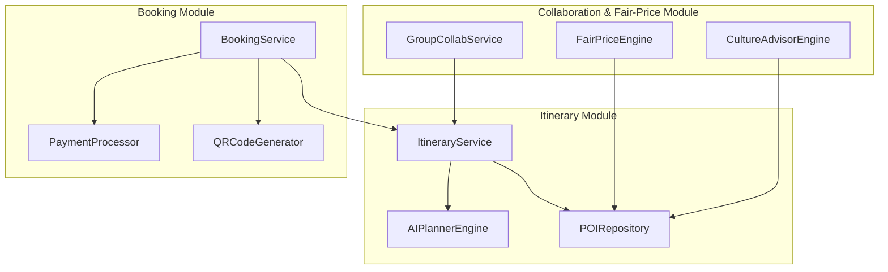
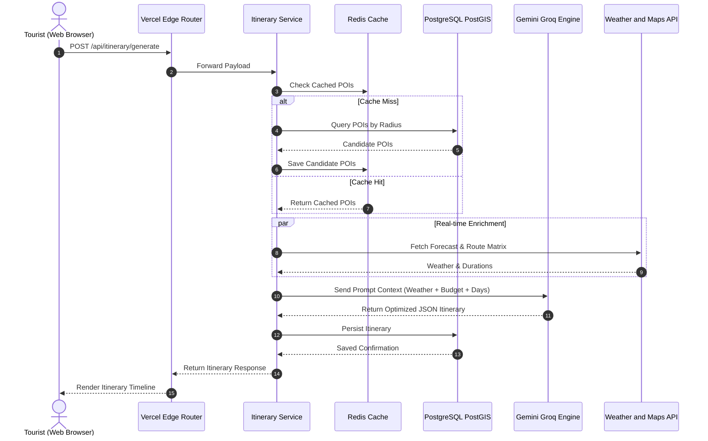
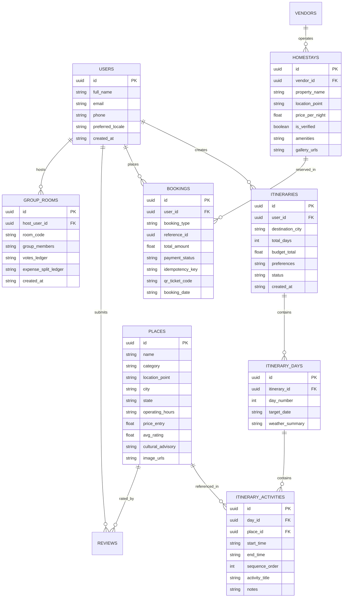
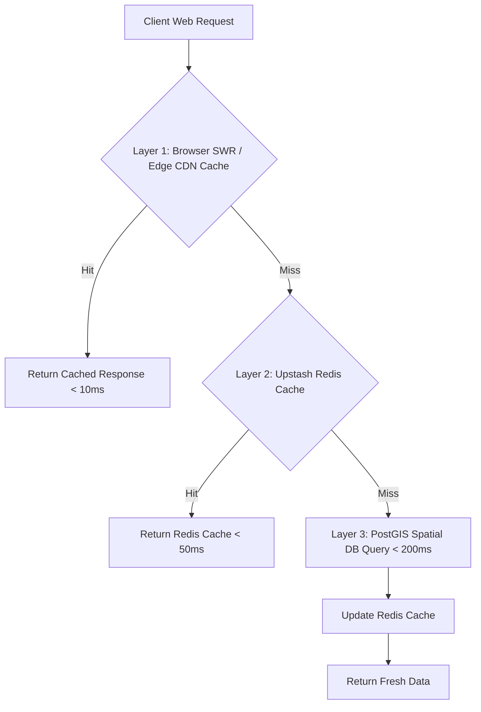

# 🏗️ High-Level & Low-Level System Design Document (HLD / LLD)
## Project: Smart Travel & Tourism Web Platform (SIH26207)
### "Discover India, Every Step of the Way" (100% Web Architecture)

---

## 1. System Overview & Design Principles

The **Smart Tourism Web Platform** is architected as an event-driven, micro-modular, cloud-native web application designed for high availability, low latency, multilingual accessibility, and instant browser performance.

---

## 2. High-Level Design (HLD)

### 2.1 End-to-End Web System Architecture

---

## 3. Low-Level Design (LLD)

### 3.1 Component Decomposition & Relationships

---

## 4. Key Workflows & Sequence Diagrams

### 4.1 Real-Time AI Itinerary Generation Workflow

---

## 5. Database Architecture & Physical Data Model

---

## 6. API Design & Specifications

### 6.1 Core RESTful Endpoints

| Method | Endpoint | Description | Request Payload / Params | Response |
| :--- | :--- | :--- | :--- | :--- |
| `POST` | `/api/itinerary/generate` | Generates a multi-day itinerary using AI | `{ city, days, budget, interests: [] }` | `{ itineraryId, days: [...] }` |
| `GET` | `/api/places/nearby` | Spatial query for POIs/homestays | `?lat=28.61&lng=77.20&radius=10` | `[{ id, name, coords, category }]` |
| `POST` | `/api/chat/message` | Multilingual AI chat assistant | `{ message, history: [], locale: "hi" }` | `{ reply, suggestedActions: [] }` |
| `POST` | `/api/scam-shield/estimate` | Fair-price calculator & phrases | `{ from, to, distanceKm, vehicleType }` | `{ estimatedFairPrice, phrases: [] }` |
| `POST` | `/api/bookings/checkout` | Creates booking & payment intent | `{ type, targetId, dateRange, amount }` | `{ orderId, qrCode, status }` |

---

## 7. Non-Functional & Resilience Strategy

### 7.1 Scalability & Caching Flow

